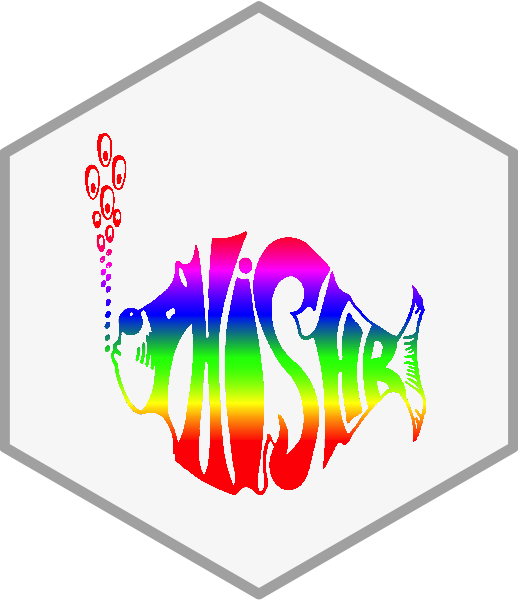

[](https://www.tidyverse.org/lifecycle/#experimental)



## phishr
 
This is a package to extract data from the Phish.net and phish.in APIs! You can use this package to search for Phish data for:
 * Setlists (both)
 * Dates (both)
 * Show ratings (.net only)
 * Jamchart entries [.net only]
 * Songs (.in only)
 * Venues (.in only)
 
 

# Example: What's the deal with Big Cypress?
 
### Install Package
```{r}
# Download package
devtools::install_github("MayaGans/phishr")
```

### Request and set API Key
```{r}
# Request API key from https://api.phish.net/keys/
# Store key as string or add to .Renvironment
phishnet_apikey <- "XXX"
```

### Search Setlist
```{r}
# Get a dataframe of songs, segues, and set songs were played in
phishr::pn_get_setlist(phishnet_key, "1999-12-31")
```

```{r}
                         Song Segue    Set
1                 Runaway Jim     , Set 1:
2                 Funky Bitch     , Set 1:
3                        Tube     , Set 1:
....
15                  Meatstick    -> Set 2:
16             Auld Lang Syne     > Set 2:
17          Down with Disease    -> Set 2:
18                      Llama     , Set 2:
19                Bathtub Gin     , Set 2:
20               Heavy Things     , Set 2:
21                      Twist    -> Set 2:
....
```

### Search show notes
```{r}
# Get the show notes 
phishr::pn_get_show_notes(phishnet_key, "1999-12-31")

"This was the second show of the Big Cypress festival. Fish was introduced as &#39;Soda Jerk&#39; during I Didn&rsquo;t Know. Split Open and Melt and Disease were unfinished. Melt contained A Love Supreme teases. After the ensuing Catapult, Trey remarked: &ldquo;Only at the largest concert in the world could we get away with playing a song like that.&rdquo; After Midnight made its Phish debut. The late set, also known as &ldquo;The Show,&rdquo; began at around 11:35. &ldquo;Father Time&rdquo; was on stage, pedaling on an exercise bike that powered a large clock. The sounds of the clock&rsquo;s gears could be heard through the sound system. About ten minutes before midnight, &ldquo;Father Time&rdquo; collapsed from exhaustion and the clock stopped. Then, a large fan boat entered the concert field and approached the stage. Early in its journey, the fan boat exploded away and revealed the hot dog used in the 1994 New Year&rsquo;s stunt. While the band rode the hot dog to the stage, an instrumental version of Meatstick began to play over the P.A.. The band reached the stage and fed several meatsticks to Father Time, reviving him so that the clock could continue moving toward midnight. The band then took the stage and played Meatstick to begin The Show. Dancers were on stage prior to Phish reaching it. Auld Lang Syne and Disease were accompanied by fireworks. Heavy Things was recorded live and rebroadcast as part of ABC television&rsquo;s New Year&rsquo;s Eve coverage. In a humorous effort to confuse the home audience, Trey instructed the crowd to yell the word &ldquo;cheesecake&rdquo; in lieu of cheering at the end of the song. After twice giving the example of yelling the word once, Trey changed his mind and instructed the crowd to chant it, adding for them to say it like they were pissed. Trey then introduced the band for the rebroadcast and offered a message of peace and harmony for the world where he reminded people to drive in the right lane unless passing another vehicle. Meatstick was subsequently teased as the New Year approached in the central time zone. Crosseyed included a DEG tease. YEM included a vocal jam based around the word &ldquo;cheesecake&rdquo; and Trey altered the lyrics to Axilla and Albuquerque to reference the word. Inlaw Josie Wales featured Trey on acoustic guitar. Quadrophonic Toppling debuted, albeit with different music than on The Siket Disc, and included My Soul teasing from Mike. Rock and Roll included an After Midnight tease. Love You included band introductions; Fish introduced Page before the song and Mike and Trey afterwards, and the band as &ldquo;Phish 2000&rdquo; (see November 2, 1990). Piper contained Bug teases from Page. 2001 began with the signature Hood drum roll. After the show closed with yet another version of Meatstick, the Beatles song Here Comes the Sun was piped through the crowd at sunrise. Two breakouts were played: Crosseyed and Painless (first since August 13, 1997, or 159 shows), and Love You (first since July 5, 1997, or 179 shows).via phish.net"
```

### Search show rating
```{r}
# Get the show rating
phishr::pn_get_show_rating(phishnet_key, "1999-12-31")

[1] 4.7568
 ```
 
# Phish.in

We can also do this using Phish.in which doesnt require an API key

```
pi_get_show_by_date("1999-12-31")
```

You can get a data.frame of all show dates this way: 

```
pi_get_all_dates()

> date       tour_name          venue_name                  
   <chr>      <chr>              <chr>                       
 1 2025-04-27 Spring Tour 2025   Hollywood Bowl              
 2 2025-04-26 Spring Tour 2025   Hollywood Bowl              
 3 2025-04-25 Spring Tour 2025   Hollywood Bowl              
 4 2025-04-23 Spring Tour 2025   Bill Graham Civic Auditorium
 5 2025-04-22 Spring Tour 2025   Bill Graham Civic Auditorium
 6 2025-04-20 Spring Tour 2025   Moda Center                 
```

You can also get song durations for every time it was played using the `pi_get_all_times_played` function

```
> pi_get_all_times_played("you-enjoy-myself")
Fetching [=======================] 6/6 pages (100%) eta:  0s
# A tibble: 575 × 10
      id title            show_date  duration_sec duration_min venue                        location mp3_url tags  taper_notes
   <int> <chr>            <chr>             <int>        <dbl> <chr>                        <chr>    <chr>   <chr> <chr>      
 1 26831 You Enjoy Myself 1986-02-03       609254        10.2  Hunt's                       Burling… https:… "Jam… "Phish\n2-…
 2 26820 You Enjoy Myself 1986-04-01       825391        13.8  Hunt's                       Burling… https:… ""    "04-01-86 …
 3    68 You Enjoy Myself 1986-04-25       625398        10.4  University of Vermont        Burling… https:… "SBD" "Phish-\r\…
 4    81 You Enjoy Myself 1986-10-15       645486        10.8  Hunt's                       Burling… https:… "SBD" "Phish\r\n…
 5   148 You Enjoy Myself 1986-12-06       653322        10.9  The Ranch                    South B… https:… "SBD" "PHISH\n\n…
 6   201 You Enjoy Myself 1987-03-23       659487        11.0  Nectar's                     Burling… https:… "SBD… "Phish 3/2…
```

We can also get information on all venues including their lat and log using `pi_get_all_venues`:

```
Fetching [=======================] 7/7 pages (100%) eta:  0s
# A tibble: 674 × 7
   name                                    latitude longitude city        state                  country location             
   <chr>                                      <dbl>     <dbl> <chr>       <chr>                  <chr>   <chr>                
 1 13x13 Club                                  35.2     -80.8 Charlotte   NC                     USA     Charlotte, NC        
 2 1stBank Center                              39.9    -105.  Broomfield  CO                     USA     Broomfield, CO   
```

# Contributing

Please (so that we have no regrets), note that this project is released with a [Contributor Code of Conduct](CODE_OF_CONDUCT.md).
By participating in this project you agree to abide by its terms.
